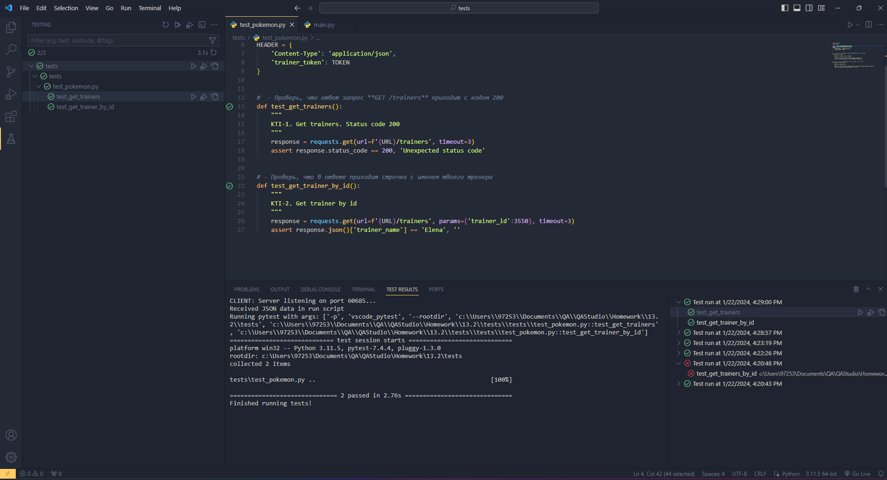
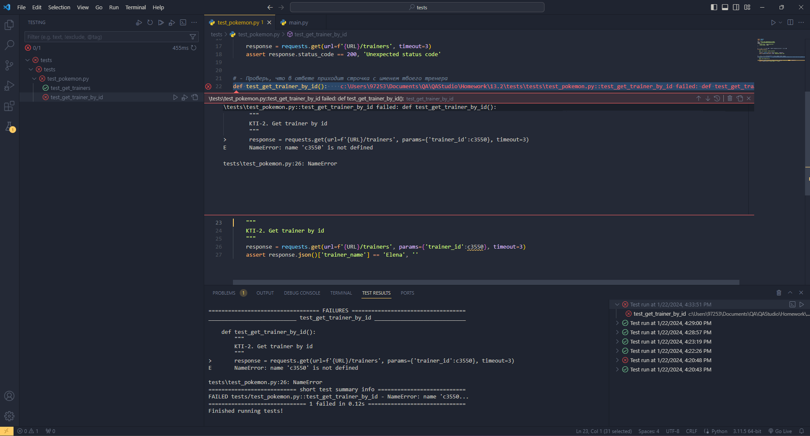

# Пример автотестов на **Python**

## [Содержание](#Содержание)

[Описание проекта](#Описание-проекта)  
[Технологический стек](#Технологический-стек)   
[Подготовка для запуска тестов](Подготовка-для-запуска-тестов)  
[Запуск тестов](Запуск-тестов)  
[Результаты прохождения тестов](#Результаты-прохождения-тестов)

### Описание проекта

Этот проект предназначен для автоматизации тестирования API сайта [Битва покемонов](https://pokemonbattle.me/),
автотесты написаны на языке **Python**, используя библиотеки **PyTest**  и **Requests**.

[Назад к содержанию](#Содержание)

### Технологический стек
<p>
    
    
    
</p>  

**[Python](https://www.python.org/)** - язык программирования для написания тестов.  

**[PyTest](https://docs.pytest.org/en/7.4.x/)** - фреймворк для организации и выполнения тестов.  

**[Requests](https://requests.readthedocs.io/en/latest/)** - библиотека для выполнения HTTP-запросов в Python.

### Подготовка для запуска тестов
Чтобы запустить тесты необходимо:
- установить **Python**
- установить библиотеки **PyTest** и **Requests**
- создать и активировать виртуальное окружение.

В командной строке выполнить команды:
```Bash
pip install pytest  # установка библиотеки pytest
pip install requests  # установка библиотеки requests
```
Для создания и активации виртуального окружения необходимо перейти в папку с проектом и в командной строке выполнить команды:
```Bash
# создание виртуальгого окружения
python -m venv env

# активировация виртуального окружения: 

# команда для Windows
.\env\Scripts\Activate.ps1 
# при возникновении ошибки ввести команды:
Set-ExecutionPolicy -Scope Process -ExecutionPolicy Bypass
.\env\Scripts\Activate.ps1

# команда для Mac и Linux
source env/bin/activate    

# Деактивация окружения
deactivate
```
[Назад к содержанию](#Содержание)

### Запуск тестов
Запуск тестов осществляется с помощью команды из командной строки **Терминала**:
```bash 
pytest test_pokemon.py
```

[Назад к содержанию](#Содержание)

### Результаты прохождения тестов

Очень легко просматривать результаты прохождения тестов, какие тесты были пройдены, какие тесты упали.

<p>
    
</p>
  
Если тест упал, можно сразу увидеть, что вызвало падение и на каком этапе.
<p>
    
</p>

[Назад к содержанию](#Содержание)

