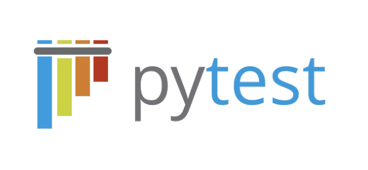
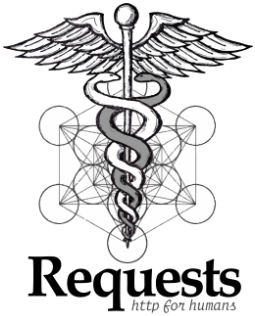

# Пример автотестов на **Python**

[PyTest](https://docs.pytest.org/en/7.4.x/) + [Requests]()

## [Содержание](#Содержание)

[Описание проекта](#Описание-проекта)  
[Технологический стек](#Технологический-стек)   
[Результаты прохождения тестов](#Результаты-прохождения-тестов)

### Описание проекта

Этот проект предназначен для автоматизации тестирования API сайта [Битва покемонов](https://pokemonbattle.me/),
автотесты написаны на языке **Python**, используя библиотеки **PyTest**  и **Requests**.

[Назад к содержанию](#Содержание)

### Технологический стек

    
    
    

  

**[Python]()** - язык программирования для написания тестов.  

**[PyTest](https://docs.pytest.org/en/7.4.x/)** - фреймворк для организации и выполнения тестов.  

**[Requests](https://requests.readthedocs.io/en/latest/)** - библиотека для выполнения HTTP-запросов в Python.

### Результаты прохождения тестов

Очень легко просматривать результаты прохождения тестов, какие тесты были пройдены, какие тесты упали.
Если тест упал, можно сразу увидеть, что вызвало падение и на каком этапе.

    
    

[Назад к содержанию](#Содержание)

